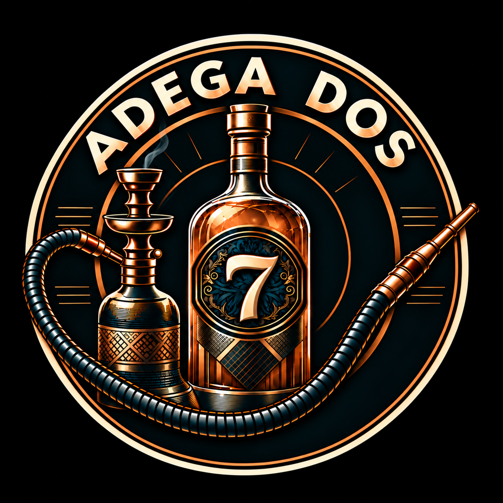

# ADEGA DOS 7

Repositório oficial para organização, evolução e preservação da identidade visual da **ADEGA DOS 7**, incluindo assets, variações temáticas, prompts, skills, agentes, provenance e documentação do processo de design.

<p align="center">
  
</p>

<p align="center">
  <a href="https://www.instagram.com/adega.dos7/">Instagram · @adega.dos7</a>
</p>

## Objetivo

O repositório funciona como **fonte de verdade da identidade visual** e como base operacional para designers e agentes de IA criarem novas artes sem perder contexto, consistência, integridade ou rastreabilidade.

> **RECOGNITION FIRST. THEME SECOND.**

Uma variação sazonal deve continuar imediatamente reconhecível como **ADEGA DOS 7**. O tema complementa a marca; não a substitui.

## Linhagem dos assets

`assets/logos/original.png` é a matriz canônica e permanente da identidade visual. Toda variação temática deve partir dela, preservar seus invariantes e adicionar somente uma camada temática controlada.

```text
assets/logos/original.png
        ├── camada temática sazonal controlada
        │       └── assets/logos/natal-2026.png
        └── camada temática sazonal controlada
                └── assets/logos/ano-novo-2027.png
```

| Asset | Papel | Regra de uso |
| --- | --- | --- |
| `original.png` | identidade-base/master | fonte de verdade para novas adaptações |
| `natal-2026.png` | variação sazonal | derivada do master; não redefine a identidade |
| `ano-novo-2027.png` | variação sazonal | derivada do master; tratamento temático contido dentro do emblema |

## Princípios da identidade

Elementos centrais atualmente tratados como referência:

- composição em formato de emblema;
- texto **ADEGA DOS** claramente legível;
- número **7** como assinatura visual dominante;
- garrafa como elemento central;
- narguilé como elemento característico;
- mangueira e piteira com lógica visual/física coerente;
- acabamento detalhado e premium;
- variações temáticas aplicadas de forma controlada.

Regras completas: **[.agents/rules/brand-integrity.md](.agents/rules/brand-integrity.md)** e **[docs/design-system.md](docs/design-system.md)**.

## Como uma nova arte é construída

O fluxo não pula do briefing diretamente para a imagem final.

```text
DISCOVER / BRIEFING
        ↓
THEME RESEARCH (quando necessário)
        ↓
DESIGN PACKET / BLUEPRINT
        ↓
PROMPT DE PRODUÇÃO
        ↓
PRIMEIRA SAÍDA = RASCUNHO
        ↓
DESIGN QA + ANOMALIAS DE IA
        ↓
EDIÇÃO CONSERVADORA
        ↓
SEGUNDA PASSAGEM DE REFINAMENTO
        ↓
TESTES DE CONTEXTO
        ↓
VALIDAÇÃO TÉCNICA + PROVENANCE
        ↓
BRANCH / PR / CI
        ↓
VALIDAÇÃO REMOTA
```

O **Design Packet** funciona como a planta do designer: registra hierarquia, composição, zonas do canvas, relações entre objetos, paleta, tipografia, safe areas, negative space e critérios de aprovação antes da produção.

Processo completo: **[docs/image-construction-workflow.md](docs/image-construction-workflow.md)**.

## Arquitetura de IA e agentes

A arquitetura foi inspirada em práticas maduras do `nexo-financeiro-api` e adaptada ao domínio da **ADEGA DOS 7**.

```text
AGENTS.md
│   fonte canônica compartilhável
│
├── .agents/
│   ├── config.json
│   ├── rules/
│   ├── specs/
│   ├── skills/
│   ├── memory/
│   ├── runs/
│   └── schemas/
│
├── .github/
│   ├── agents/
│   ├── instructions/
│   ├── prompts/
│   ├── workflows/
│   └── copilot-instructions.md
│
├── CLAUDE.md
├── GEMINI.md
└── docs/
```

### Skills canônicas

- `repository-discovery` — mapeia impacto e fontes de verdade;
- `planning` — transforma pedidos em critérios verificáveis;
- `task-completion` — mantém requisitos/evidências em tarefas longas;
- `image-production` — briefing → blueprint → produção → refinamento;
- `design-review` — revisão adversarial visual/semântica;
- `asset-management` — integridade de binários e upload;
- `agent-asset-vetting` — avalia skills/plugins/MCPs/hooks externos;
- `documentation` — mantém docs, provenance e instruções consistentes.

As skills ficam em **[.agents/skills/](.agents/skills/)** para reduzir acoplamento a um fornecedor e permitir progressive disclosure.

### Agentes especialistas

- **Art Director** — direção criativa, Design Packet e produção;
- **Brand Guardian** — invariantes, nomenclatura e factualidade;
- **Design QA** — auditoria visual e técnica;
- **Visual Researcher** — pesquisa temática, códigos visuais e riscos de associação.

Veja **[docs/agent-compatibility.md](docs/agent-compatibility.md)**.

## Prompts reutilizáveis

Em `.github/prompts/`:

- `research-theme.prompt.md` — pesquisa o tema;
- `design-blueprint.prompt.md` — cria a planta/rascunho estrutural;
- `create-themed-image.prompt.md` — prepara a produção temática;
- `review-image.prompt.md` — revisão adversarial;
- `record-provenance.prompt.md` — registra como a arte foi construída;
- `vet-agent-asset.prompt.md` — avalia capacidade externa antes de adoção.

Prompt mestre universal: **[docs/image-generation-prompt.md](docs/image-generation-prompt.md)**.

## Provenance: como cada imagem foi criada

Cada arte relevante pode ter um registro com:

- objetivo/contexto;
- referências/fontes;
- invariantes e variáveis;
- Theme Research Pack;
- Design Packet/blueprint;
- topologia dos objetos;
- paleta/materialidade/tipografia;
- iterações e problemas encontrados;
- decisões de correção;
- critérios de aprovação;
- dimensões, tamanho, hashes e blob remoto;
- limitações de reprodutibilidade.

Registros atuais: **[Logo original — Design Packet e provenance](docs/assets/original.md)**, **[Natal 2026 — Design Packet, plano de produção e provenance](docs/assets/natal-2026.md)** e **[Ano Novo 2027 — Design Packet e provenance](docs/assets/ano-novo-2027.md)**.

Template: **[docs/templates/asset-design-record.md](docs/templates/asset-design-record.md)**.

## Gestão segura de imagens

Arquivos raster são binários e não devem ser gravados por operações destinadas a UTF-8/texto.

Antes e depois de qualquer alteração em `assets/`, valide:

1. formato real;
2. dimensões;
3. tamanho em bytes;
4. estrutura/decodificação completa;
5. SHA-256;
6. path/blob remoto;
7. preview/download completo após o push.

```bash
python scripts/validate_assets.py
python scripts/validate_repository.py
```

Detalhes: **[docs/asset-management.md](docs/asset-management.md)**.

## Supply chain de agentes

Skills, plugins, MCPs, hooks, extensões e agentes externos não são incorporados apenas por popularidade. O fluxo é:

```text
DISCOVER
  ↓
SOURCE_VERIFY
  ↓
LICENSE
  ↓
STATIC_REVIEW
  ↓
PERMISSIONS
  ↓
OVERLAP
  ↓
SANDBOX / BENCHMARK
  ↓
ADOPT | ADAPT | TRIAL | REJECT | SUPERSEDED
```

Referências já avaliadas: **[docs/agent-assets.md](docs/agent-assets.md)**.

## Convenção de nomes

Identidade-base:

```text
original.png
```

Variações temáticas:

```text
<tema>-<ano>.<extensão>
```

Exemplos:

```text
copa-2026.png
natal-2026.png
ano-novo-2027.png
carnaval-2027.png
```

Não usar `final`, `v2`, `definitivo`, `corrigido` etc. O Git é responsável pelas revisões.

## Referências de mercado

A arquitetura usa documentação e referências de OpenAI/Codex, GitHub Copilot, Anthropic/Agent Skills, Gemini CLI, Nielsen Norman Group, Apple Human Interface Guidelines e WCAG.

Veja **[docs/references.md](docs/references.md)**.

## Definição de pronto

Uma mudança só é considerada concluída quando:

- requisitos possuem evidência;
- identidade da **ADEGA DOS 7** está preservada;
- não há anomalias estruturais relevantes;
- checks aplicáveis foram executados;
- assets estão tecnicamente íntegros;
- provenance foi atualizado quando necessário;
- PR/CI e gates humanos aplicáveis foram respeitados;
- arquivo remoto foi validado quando houve upload/substituição.
